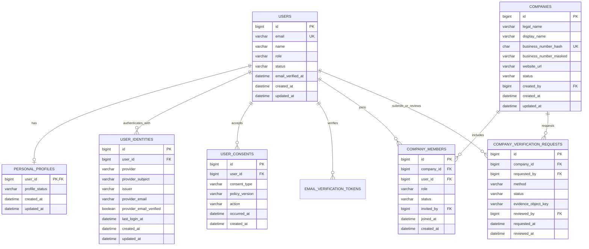

# DJC 개인·기업 회원 도메인 ERD 및 DB 설계 전략 초안

> 상태: Draft 0.1
> 작성일: 2026-08-19
> 범위: 회원가입, 인증 주체, 개인 프로필, 기업과 기업 담당자, 약관 동의, 기업 검증

## 1. 점검 결과

### 운영 화면

- `https://djc.itsdev.kr/signup`은 HTTP 200으로 응답한다.
- 배포된 프론트 번들에는 `개인회원`, `기업회원 가입은 준비 중입니다.`, `/auth/signup/personal`이 포함되어 있다.
- 현재 화면은 개인회원 가입만 활성화되어 있고 기업회원 탭은 비활성화되어 있다.
- 가입 제출은 데이터 생성을 수반하므로 이번 점검에서는 수행하지 않았다.

### 저장소와 마이그레이션

- Flyway V2는 `users`, `email_verification_tokens`를 생성한다.
- 개인 이메일 가입 API와 서비스는 `users`에 계정을 생성하고 이메일 인증 후 활성화한다.
- `personal_members` 또는 `personal_profiles`처럼 개인회원 전용 속성을 저장하는 테이블은 없다.
- 기업 조직, 기업 담당자, 기업 검증을 표현하는 테이블과 기업회원 가입 API는 없다.
- 가입 요청의 필수 약관 및 개인정보 동의는 boolean 검증만 하고 버전·동의 시각을 DB에 남기지 않는다.
- 이력서 기능은 현재 메모리 저장소를 사용하며 인증된 `users`와 영속 FK로 연결되지 않는다.

### 중요한 정정

`개인회원 테이블이 없다`는 표현은 두 가지로 나눠야 한다.

1. 공통 로그인 계정 테이블: `users`가 이미 존재한다.
2. 개인회원 도메인 프로필 테이블: 현재 존재하지 않는다.

운영 DB에 `users` 자체가 없다면 설계 누락보다 배포 대상 DB, 기본 스키마 또는 Flyway 적용 이력 불일치일 가능성이 높다. 먼저 아래를 확인한다.

```sql
SELECT DATABASE();
SHOW TABLES LIKE 'users';
SHOW TABLES LIKE 'email_verification_tokens';
SELECT installed_rank, version, description, success
FROM flyway_schema_history
ORDER BY installed_rank;
```

## 2. 설계 원칙

### 공통 계정과 회원 유형을 분리한다

- `users`는 로그인·인증·계정 상태만 책임지는 공통 인증 주체다.
- 개인회원 정보는 `personal_profiles`에 1:0..1로 분리한다.
- 기업은 사용자가 아니라 독립 조직인 `companies`로 모델링한다.
- 사용자가 기업에서 갖는 권한은 `company_members` 연결 테이블에 둔다.
- `users.account_type = PERSONAL | COMPANY` 같은 단일 유형 컬럼은 두지 않는다. 한 사용자가 개인 구직 활동과 기업 채용 업무를 동시에 하거나 여러 기업에 소속될 수 있기 때문이다.

### 역할과 상태를 섞지 않는다

- 플랫폼 전역 권한은 `users.role`에 둔다: `USER`, `PLATFORM_ADMIN` 등.
- 기업 내부 권한은 `company_members.role`에 둔다: `OWNER`, `ADMIN`, `RECRUITER`, `VIEWER`.
- 계정 상태, 기업 검증 상태, 기업 소속 상태는 각각 별도 컬럼으로 관리한다.

### 인증과 도메인 데이터를 분리한다

- 비밀번호와 OAuth 식별자는 인증 영역이다.
- 이름, 경력, 기업 정보, 채용 담당자 권한은 도메인 영역이다.
- 장기적으로 한 사용자에게 LOCAL·Google·GitHub 로그인을 함께 연결하려면 `user_identities`로 분리한다.

### 개인정보는 필요한 시점에만 수집한다

- 생년월일, 성별, 주소 등 가입에 불필요한 개인정보는 받지 않는다.
- 사업자등록번호 원문은 평문 저장하지 않는다. 중복 확인용 keyed hash와 화면 표시용 마스킹 값만 저장하고, 원문 보관이 법적·업무적으로 필요할 때만 별도 암호화 저장소를 사용한다.
- 증빙 파일은 DB BLOB 대신 접근 통제된 오브젝트 스토리지 키를 저장한다.

## 3. 권장 개념 ERD



## 4. 테이블별 책임과 핵심 제약

| 테이블 | 책임 | 필수 제약 및 인덱스 |
|---|---|---|
| `users` | 공통 인증 주체와 전역 계정 상태 | `UNIQUE(email)`, 상태 인덱스 |
| `personal_profiles` | 개인회원에게만 필요한 프로필 | `user_id` PK/FK, 사용자당 최대 1행 |
| `user_identities` | LOCAL/OAuth 로그인 수단 | `UNIQUE(provider, provider_subject)`, `UNIQUE(user_id, provider)` MVP |
| `user_consents` | 약관·개인정보 정책 동의 이벤트 감사 이력 | append-only, 사용자/유형/버전/발생시각 인덱스 |
| `companies` | 채용 주체인 기업 조직 | 사업자번호 hash unique, 검증 상태 인덱스 |
| `company_members` | 사용자와 기업의 N:M 소속·권한 | `UNIQUE(company_id, user_id)`, 기업/상태/역할 복합 인덱스 |
| `company_verification_requests` | 기업 인증 신청 및 심사 감사 이력 | 기업/상태/신청시각 인덱스, 증빙 접근 통제 |

### 상태 권장값

- `users.status`: `PENDING_EMAIL`, `ACTIVE`, `SUSPENDED`, `WITHDRAWN`
- `personal_profiles.profile_status`: `ACTIVE`, `PRIVATE`, `DELETED`
- `companies.status`: `PENDING_VERIFICATION`, `VERIFIED`, `REJECTED`, `SUSPENDED`, `CLOSED`
- `company_members.status`: `INVITED`, `ACTIVE`, `SUSPENDED`, `LEFT`
- `company_verification_requests.status`: `PENDING`, `APPROVED`, `REJECTED`, `CANCELLED`

DB ENUM 대신 길이가 제한된 VARCHAR와 애플리케이션 enum을 우선 사용한다. 상태 추가 시 DDL 변경을 줄이되, 서비스 계층과 테스트에서 허용값을 강제한다.

## 5. 가입 전략

### 개인회원

1. `users` 생성: `PENDING_EMAIL`.
2. 필수 정책 버전별 `user_consents` 기록.
3. 이메일 인증 성공 시 `users.ACTIVE` 전환.
4. 이메일 인증 완료 시 `personal_profiles`를 생성한다. 사용자명은 `users.name`을 사용하고 중복 `display_name` 컬럼은 두지 않는다.
5. 이력서·북마크는 URL의 임의 `userId`가 아니라 인증 토큰의 사용자 ID로 연결한다.

### 기업회원

1. 담당자 개인의 `users` 계정을 생성하고 이메일을 인증한다.
2. `companies`를 `PENDING_VERIFICATION`으로 생성한다.
3. 생성자를 `company_members.OWNER`로 연결하되, 검증 전에는 기업 기능 권한을 제한한다.
4. 기업 인증 신청과 증빙을 `company_verification_requests`에 기록한다.
5. 승인 시 `companies.VERIFIED`, 소유자 membership `ACTIVE`로 전환한다.
6. 이후 담당자 초대는 동일 기업의 `OWNER` 또는 `ADMIN`만 수행한다.

### 트랜잭션 경계

- 계정·동의·개인 프로필 생성은 하나의 로컬 트랜잭션으로 처리한다.
- 기업·소유자 membership·검증 신청 생성도 하나의 로컬 트랜잭션으로 처리한다.
- 이메일 발송과 외부 기업 검증은 트랜잭션 밖의 재시도 가능한 작업으로 분리하고, outbox 도입 여부는 실패율 측정 후 결정한다.

## 6. 기존 수집 도메인과의 경계

- `company_source_target`은 외부 채용공고 수집 대상을 표현한다.
- 새 `companies`는 DJC에 가입하고 검증된 채용 기업을 표현한다.
- 두 개념은 동일하지 않으므로 즉시 합치지 않는다.
- 연결이 필요해질 때 `company_source_target.company_id`를 검증된 `companies.id`에 선택적으로 연결하되, 자동 이름 매칭으로 FK를 생성하지 않는다.
- 기존 `job_posts.company_name`도 수집 원문 성격을 유지한다. 기업 직접 등록 공고가 추가되면 `employer_company_id NULL FK`를 별도 도입한다.

## 7. Flyway 전환 전략

이미 운영 적용된 V1/V2는 수정하지 않고 새 버전만 추가한다.

1. **V3**: `personal_profiles`, `user_consents`, `user_identities` 생성, 기존 LOCAL/OAuth 사용자 backfill.
2. **V4**: `companies`, `company_members` 생성.
3. **V5**: `company_verification_requests` 생성.
4. **V6 이후**: 이력서·북마크·직접 등록 공고를 인증 사용자 및 기업 FK에 연결.

`user_identities`를 V3에 포함하는 결정은 Multi-Provider Authentication Architecture v1.1이 본 초안의 이전 V6 후순위 안을 대체한 결과다. V3에서는 기존 `users.provider`, `users.provider_user_id`, `users.password_hash`를 즉시 삭제하지 않고 호환 경로를 유지한다.

각 버전은 clean MySQL 설치와 V2 운영 스냅샷 업그레이드 두 경로를 모두 검증한다. 컬럼 삭제 및 `NOT NULL` 강화는 backfill과 읽기 전환이 완료된 후 별도 마이그레이션으로 수행한다.

## 8. 구현 지침

- API 요청의 회원 유형 문자열만 믿지 말고 생성된 리소스와 membership을 기준으로 권한을 판단한다.
- 기업 API는 `company_id`와 JWT 사용자 사이의 활성 membership을 매 요청 검증한다.
- `OWNER`가 0명이 되는 탈퇴·권한 변경을 금지한다.
- 이메일, OAuth 식별자, 사업자번호 중복 생성은 사전 조회가 아니라 DB unique 제약을 최종 기준으로 처리한다.
- 가입·초대·기업 승인 API에는 rate limit과 감사 로그를 적용한다.
- 탈퇴는 즉시 물리 삭제 대신 상태 전환, 토큰 폐기, 개인정보 파기 스케줄을 분리한다.
- 로그에 비밀번호, 인증 코드, OAuth 토큰, 사업자번호 원문, 증빙 URL을 남기지 않는다.
- 목록 인덱스는 실제 조회 쿼리와 `EXPLAIN` 결과로 확정한다. 추측성 인덱스를 과다 생성하지 않는다.
- 서비스 코드는 `users.role`로 기업 권한을 판정하지 않는다. 기업 권한의 source of truth는 `company_members`다.

## 9. 검증 계획과 완료 기준

### 목표 KPI

- Flyway clean 설치 및 V2 업그레이드 성공률: **100%**
- 기존 `users` 데이터 손실 및 계정 중복: **0건**
- 개인/기업 가입 핵심 시나리오 성공률: **100%**
- 동시 중복 가입에서 중복 사용자·기업·membership 생성: **0건**
- 필수 동의 감사 레코드 누락률: **0%**
- 무권한 기업 리소스 접근 차단률: **100%**
- DB 구간 가입 API p95: **300ms 이하**. 이메일 발송 및 외부 기업 검증 시간은 별도 측정한다.

### OKR 연결

- 개인 사용자의 저장·이력서 기능 기반을 만들고 가입 완료율을 측정 가능하게 한다.
- 검증된 기업 담당자만 채용 기능을 사용할 수 있게 하여 기업 기능의 신뢰성과 감사 가능성을 확보한다.

### 평가셋

- clean MySQL 8.4 마이그레이션 1회 이상.
- 운영 V2 익명화 스냅샷 기반 V3+ 업그레이드 1회 이상.
- 개인 가입: LOCAL 50건, Google/GitHub 각 20건.
- 기업 가입: 신규 기업 30건, 기존 기업 초대 20건.
- 동일 이메일·사업자번호·membership 동시 요청: 유형별 20회, 동시성 10.
- 권한 매트릭스: 4개 기업 역할 × 5개 기업 상태 × 핵심 API.
- 약관 버전 변경, 이메일 인증 만료·재발송, 기업 검증 승인·거절·재신청 시나리오.

### Before / After

| 항목 | Before | 목표 After |
|---|---|---|
| 공통 계정 | `users` 존재 | 유지, 인증 source of truth로 명확화 |
| 개인 프로필 | 없음 | 사용자당 최대 1개 |
| 동의 이력 | request boolean만 검증 | 정책 버전별 감사 레코드 100% |
| 기업 가입 | UI 비활성, API/DB 없음 | 조직·담당자·검증 상태 영속화 |
| 기업 권한 | 없음 | membership 기반 권한 매트릭스 100% 통과 |
| 이력서 영속성 | 메모리 저장 | 인증 사용자 FK 기반 영속화는 후속 단계 |

현재 성능 baseline은 측정되지 않았다. 구현 전 현행 개인 가입 DB 구간 p50/p95와 오류율을 먼저 수집하고, After 결과에 실측값을 기록한다.

### 합격 기준

- 스키마 제약과 애플리케이션 권한 테스트가 모두 통과한다.
- V2 운영 데이터 backfill 후 orphan FK가 0건이다.
- 개인과 기업 가입 E2E에서 생성된 행과 상태 전이가 ERD와 일치한다.
- 약관 동의, 기업 검증 및 역할 변경 이력을 관리자 감사 쿼리로 재현할 수 있다.
- 롤백 절차와 개인정보 파기 정책이 문서화되어 있다.

## 10. 설계 확정 전 결정할 항목

1. 개인 프로필을 이메일 인증 직후 생성할지 최초 프로필 사용 시 생성할지.
2. 기업 검증 방법: 사업자등록번호 API, 기업 도메인 이메일, 서류 수동 심사 중 MVP 범위.
3. 한 사용자의 다중 기업 소속 허용 여부. 본 초안은 허용을 권장한다.
4. LOCAL 비밀번호 해시를 V3에서 `user_identities`로 이동할지, 전환 기간 동안 `users.password_hash`에 유지할지. 기본안은 호환성을 위해 유지 후 별도 마이그레이션이다.
5. 기업 직접 공고 등록을 현재 수집형 `job_posts`에 포함할지 별도 작성 모델로 둘지.
6. 탈퇴 후 보존해야 할 법적·정산·감사 데이터와 보존 기간.

## 11. 다음 작업 순서

1. 운영 DB에서 V2와 `users` 실재 여부를 위 감사 SQL로 확인한다.
2. 제품 요구사항으로 개인회원 기능과 기업회원 MVP 권한 범위를 확정한다.
3. 논리 ERD를 확정하고 컬럼 사전 및 개인정보 분류표를 작성한다.
4. V3 Identity/Consent Foundation부터 Flyway DDL과 마이그레이션 테스트를 구현한다.
5. 개인 가입의 동의 영속화부터 적용한 뒤 기업 가입을 단계적으로 연다.
